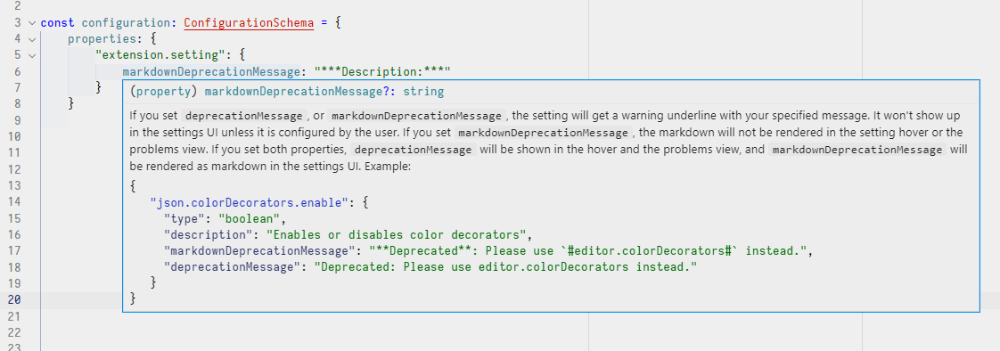

# VS Code Contribution Schema

TypeScript type declaration for working with VS Code extension contributions. Narrowed form of full JSON schema removing (currently) restricted schema keys (`$ref`, `$id`, etc.) and additional defintions for contribution properties. (WIP)

